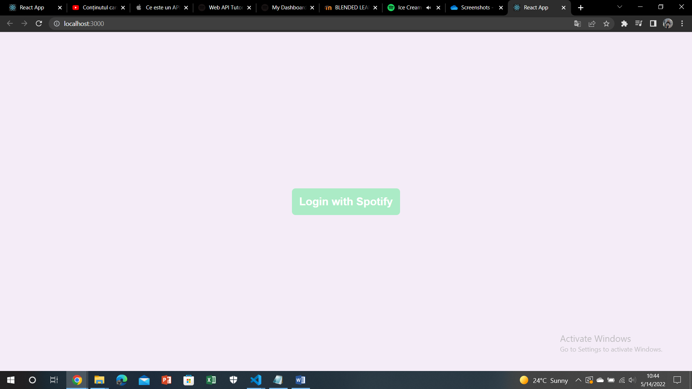
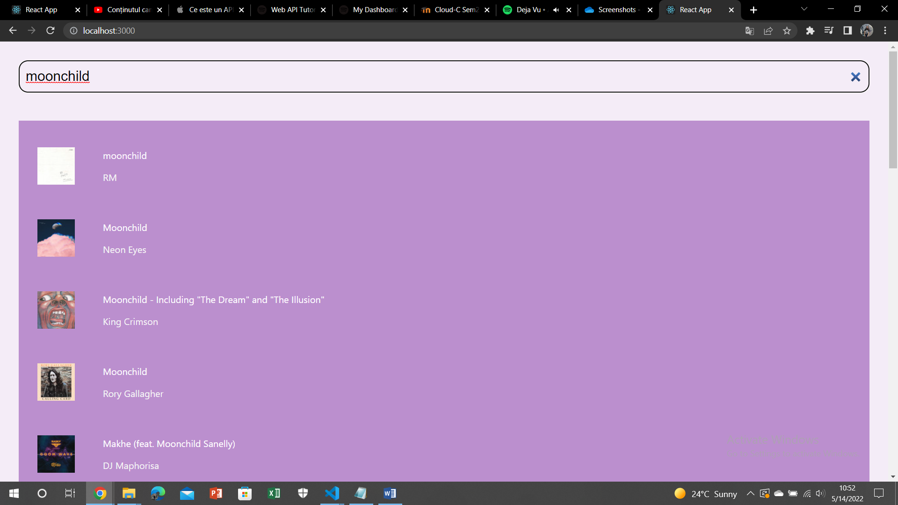
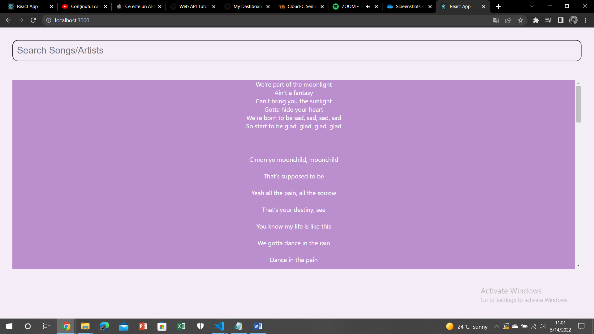

# Documentație Aplicație
## Introducere

## Descriere problemă
Problema propusa spre rezolvare este cautarea unei melodii disponibila pe Spotify si afisarea versurilor acesteia. Pentru rezolvarea acestei probleme am utilizat Spotify API pentru autorizarea aplicatiei si cautarea unei melodii disponibila pe Spotify si lyrics.ovh pentru cautarea versurilor melodiei respective si afisarea acestora pe ecran.

## Descriere API
Un API (Application Programming Interface) este utilizat pentru a trimite date intre aplicatiile software. Un API REST utilizeaza request-uri HTTP pentru a gestiona datele, precum GET, PUT, POST, DELETE.

#### Lyrics.ovh API
Fiind un API al carui scop este aducerea de versuri pentru o anumita melodie si un anumit artist, lyrics.ovh poate fi utilizat creand un request de tip GET ce are ca parametri numele artistului si titlul melodiei. URL-ul prin care se poate realiza un request catre API este https://api.lyrics.ovh/v1/artist/title, unde artist si title sunt trimisi ca parametri. Utilizand biblioteca Axios am realizat un request catre API si a aduce versurile melodiei cautate anterior.

```
 (async () => {
      const {
        data: { lyrics },
      } = await axios.get("https://api.lyrics.ovh/v1/" + playingTrack.artist + "/" + playingTrack.title);
      setLyrics(lyrics);
    })();
 ```
 #### Spotify API
Am utilizat Spotify API pentru a cauta melodii pe baza artistului si/sau titlului. Acesta ofera acces la datele utilizatorului, dar si la datele disponibile legate de melodiile si artistii aflati pe Spotify. Pentru a ne putea conecta aplicatia la API este nevoie sa ne inregistram pe https://developer.spotify.com/dashboard/login si sa cream o aplicatie pentru a primi un client_id si un client_secret ce vor fi folosite ulterior pentru a ne conecta la API. Tot aici este necesar sa furnizam aplicatiei un redirect_uri pentru ca API-ul sa stie unde sa ne redirecteze dupa ce realizeaza autorizarea, in cazul de fata va fi http://localhost:3000. 
 
Vom crea un request de tip POST pentru a ne autoriza aplicatia si a ne conecta la Spotify API. Ca si raspuns vom primi un acces_token si un refresh_token ce ne permit accesul la API.
```
useEffect(() => {
    (async () => {
      try {
        const {
          data: { access_token, refresh_token, expires_in },
        } = await axios.post(`${process.env.REACT_APP_BASE_URL}/login`, {
          code,
        });
        setAccessToken(access_token);
        setRefreshToken(refresh_token);
        setExpiresIn(expires_in);
        window.history.pushState({}, null, '/');
      } catch {
        window.location = '/';
      }
    })();
  }, [code]);
  ```

## Flux de date
Fluxul de date intre backend si frontend se realizeaza cu ajutorul mecanismului request-response. Pentru codul de mai sus de conectare la API de pe frontend se utilizeaza biblioteca axios pentru a face legatura cu request-ul de pe backend.
Utilizand un obiect de tip SpotifyWebApi din pachetul spotify-web-api-node vom prelua codul de autorizare din body si vom astepta sa ni se aprobe accesul la API. Ca raspuns vom primi un acces_token si un request_token necesare pentru avea acces la API, dar si expires_in ce reprezinta in cat timp expira acces_token primit anterior. Toate acestea sunt trimise ca si raspuns.
```

spotifyLoginRouter.post('/', async (req, res) => {
    const { code } = req.body;
  
    const spotifyApi = new SpotifyWebApi({
      redirectUri: process.env.REDIRECT_URI,
      clientId: process.env.CLIENT_ID,
      clientSecret: process.env.CLIENT_SECRET,
    });
  
    try {
      const {
        body: { access_token, refresh_token, expires_in },
      } = await spotifyApi.authorizationCodeGrant(code);
  
      res.json({ access_token, refresh_token, expires_in });
    } catch (err) {
      console.log(err);
      res.sendStatus(400);
    }
  });
  ```
  
## Capturi ecran aplicație
Aplicatia porneste cu pagina de start, unde avem optiunea de a ne conecta la Spotify.


Urmatoarea pagina ne ofera optiunea de a cauta melodii utilizand Spotify API, pe baza de artist si/sau titlul melodiei. In input-ul de tip search putem introduce un anumit keyword reprezentand numele artistului sau al melodiei si vor fi afisate rezultatele gasite pe Spotify, impreuna cu imaginea disponibila.



Atunci cand selectam o melodie vom fi redirectionati catre pagina de afisare a versurilor pentru melodia respectiva. Asteptam sa se realizeze request-ul catre Lyrics.ovh API, iar versurile vor fi afisate de indata ce se primeste un raspuns.

## Referințe
* [Lyrics.ovh API](https://github.com/public-apis/public-apis)
* [Lyrics.ovh API Website](https://lyricsovh.docs.apiary.io/#)
* [Spotify API](https://developer.spotify.com/documentation/web-api/quick-start/)
* [Despre API](https://support.apple.com/ro-ro/guide/shortcuts-mac/apd2e30c9d45/mac)
